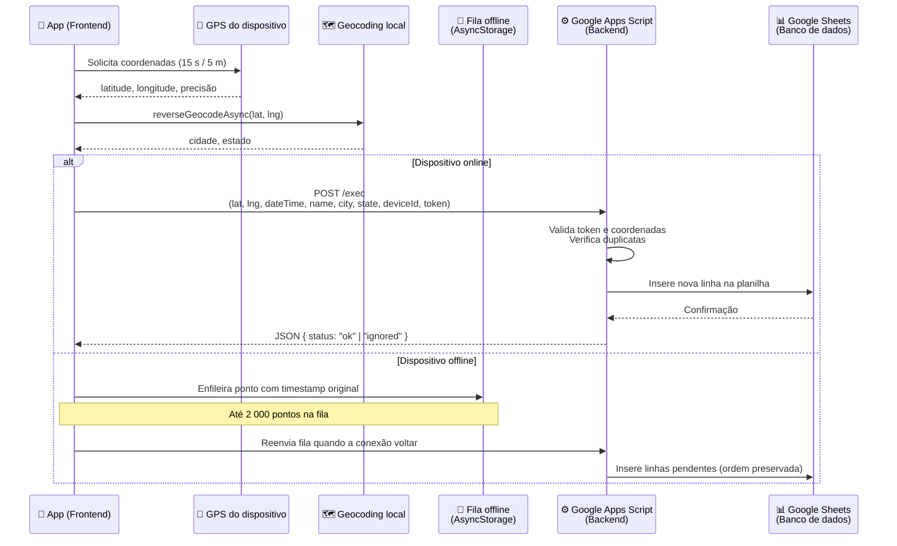
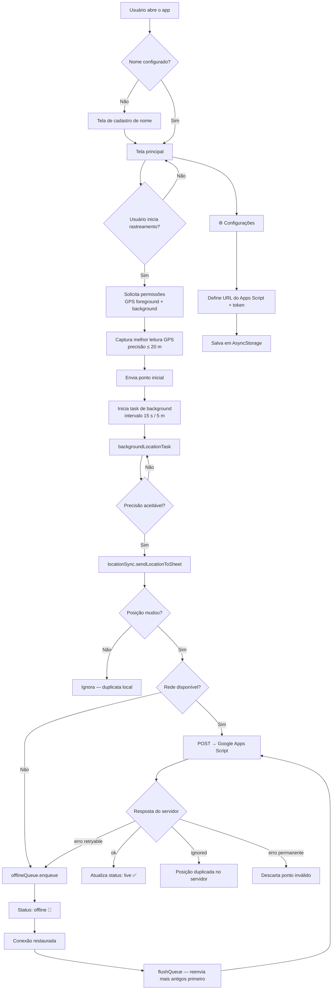

# Localização Tracker

Aplicativo Android de rastreamento de localização em tempo real. Captura coordenadas GPS do dispositivo e registra cada posição em uma planilha Google Sheets, usando Google Apps Script como backend serverless.

---

## Visão geral

O **Localização Tracker** foi desenvolvido para monitorar deslocamentos de forma contínua, inclusive em segundo plano. Cada ponto registrado inclui latitude, longitude, data/hora, nome do usuário, cidade, estado e identificador do dispositivo.

A arquitetura é **sem servidor próprio**: o app se comunica diretamente com um **Google Apps Script** publicado como Web App, que valida os dados e grava as linhas na **Google Sheets** — que funciona como banco de dados.

| Camada | Tecnologia |
|--------|------------|
| **Frontend (app mobile)** | React Native · Expo SDK 54 · TypeScript |
| **Backend** | Google Apps Script (Web App `/exec`) |
| **Banco de dados** | Google Sheets (planilha) |
| **Build Android** | Docker · Gradle · Expo Prebuild |

---

## Estrutura do repositório

```
App-Location/
├── localizacao-tracker/          # App Expo / React Native
│   ├── app/                      # Rotas (Expo Router)
│   │   ├── (tabs)/index.tsx      # Tela principal de rastreamento
│   │   └── settings.tsx          # Configurações (URL e token)
│   ├── components/tracker/       # UI: status, coordenadas, botões
│   ├── hooks/                    # Lógica de tela (tracking, sync, config)
│   ├── services/                 # GPS, sync, fila offline, geocoding
│   └── constants/                # URLs, tokens, chaves de storage
├── docker/                       # Script de build do APK
├── Dockerfile                    # Imagem Docker (Node + Android SDK)
├── docker-compose.yml
└── build-apk.sh                  # Comando único para gerar o APK
```

---

## Fluxo de conexão: Frontend → Backend → Banco de dados



---

## Fluxo interno do aplicativo



---

## Componentes principais

### Frontend (app mobile)

| Módulo | Responsabilidade |
|--------|------------------|
| `useLocationTracking` | Inicia/para rastreamento, atualiza coordenadas na tela |
| `backgroundLocationTask` | Task em segundo plano — captura GPS e dispara envio |
| `locationSync` | Envia pontos ao Apps Script, gerencia fila e retries |
| `offlineQueue` | Persiste pontos não enviados no AsyncStorage (até 2 000) |
| `reverseGeocode` | Converte coordenadas em cidade/estado (local, via Expo) |
| `sheetConfig` | URL do script e token de autenticação (configuráveis) |
| `syncStore` | Monitora status de sync (live / offline / failed / waiting) |
| `deviceId` | Identificador estável do dispositivo (Android ID / UUID) |

### Backend (Google Apps Script)

O script roda na infraestrutura do Google e expõe um endpoint HTTP via URL `/exec`. Ele **não está neste repositório** — é implantado separadamente no Google Apps Script e vinculado à planilha de destino.

Responsabilidades esperadas do script:

1. Receber requisições `POST` com os campos do ponto
2. Validar o **token** de sincronização
3. Rejeitar coordenadas inválidas ou duplicadas
4. Inserir uma nova linha na planilha com os dados recebidos
5. Retornar JSON: `{ "status": "ok" }`, `{ "status": "ignored" }` ou erro

### Banco de dados (Google Sheets)

A planilha funciona como armazenamento persistente. Cada linha representa um registro de localização com campos como:

- Data/hora
- Latitude / Longitude
- Nome do usuário
- Cidade / Estado
- ID do dispositivo
- Nome do app

---

## Payload enviado ao backend

O app envia um `POST` com `Content-Type: application/x-www-form-urlencoded`:

| Campo | Descrição |
|-------|-----------|
| `latitude` | Latitude GPS |
| `longitude` | Longitude GPS |
| `dateTime` | Timestamp ISO 8601 do momento da captura |
| `appName` | Nome do aplicativo |
| `name` | Nome do usuário (cadastrado no app) |
| `city` | Cidade (geocoding reverso) |
| `state` | Estado (geocoding reverso) |
| `deviceId` | Identificador único do dispositivo |
| `token` | Token de autenticação configurado no Apps Script |

---

## Modo offline

Quando não há conexão ou o servidor está indisponível:

1. O ponto é salvo na **fila offline** (`AsyncStorage`)
2. A fila preserva o **timestamp original** da captura
3. Ao restaurar a conexão, os pontos são reenviados **do mais antigo ao mais recente**
4. Erros permanentes (token inválido, coordenadas inválidas) descartam o ponto; erros temporários (rede) mantêm na fila

---

## Configuração

Na tela **Configurações** (ícone ⚙️ no header), é possível informar:

- **URL do Apps Script** — link de implantação no formato `https://script.google.com/macros/s/.../exec`
- **Token de sincronização** — deve coincidir com o valor configurado no script

Os valores são persistidos localmente e usados em todos os envios subsequentes.

---

## Build do APK

O projeto inclui pipeline Docker para gerar o APK sem configurar Android SDK localmente:

```bash
./build-apk.sh                  # build rápido
./build-apk.sh --rebuild-image  # reconstrói imagem (após mudar deps)
./build-apk.sh --clean-prebuild # regera projeto Android nativo
```

O APK gerado fica em `./build/localizacao-tracker.apk`.

---

## Stack técnica

- **Expo SDK 54** · React Native 0.81 · React 19
- **expo-location** — GPS foreground e background
- **expo-task-manager** — task de rastreamento em segundo plano
- **AsyncStorage** — persistência local (config, fila, cache)
- **NetInfo** — detecção de conectividade
- **Expo Router** — navegação por arquivos
- **Docker** — build reproduzível do APK Android (arm64-v8a)

---

## Resumo da arquitetura

```
┌─────────────────────────────────────────────────────────┐
│                    📱 FRONTEND                          │
│         React Native / Expo (Android APK)               │
│                                                         │
│  GPS → Geocoding → locationSync → offlineQueue          │
└────────────────────────┬────────────────────────────────┘
                         │  HTTPS POST (form-urlencoded)
                         ▼
┌─────────────────────────────────────────────────────────┐
│                    ⚙️ BACKEND                           │
│           Google Apps Script (Web App)                  │
│                                                         │
│  Valida token → Deduplica → Grava linha                 │
└────────────────────────┬────────────────────────────────┘
                         │  Google Sheets API
                         ▼
┌─────────────────────────────────────────────────────────┐
│                 📊 BANCO DE DADOS                       │
│              Google Sheets (planilha)                   │
│                                                         │
│  Uma linha por registro de localização                  │
└─────────────────────────────────────────────────────────┘
```
